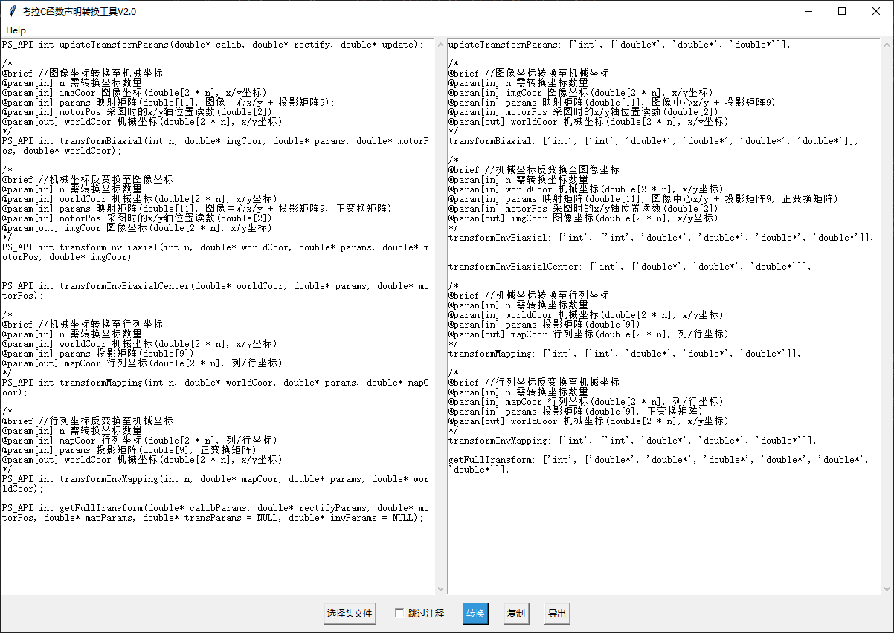
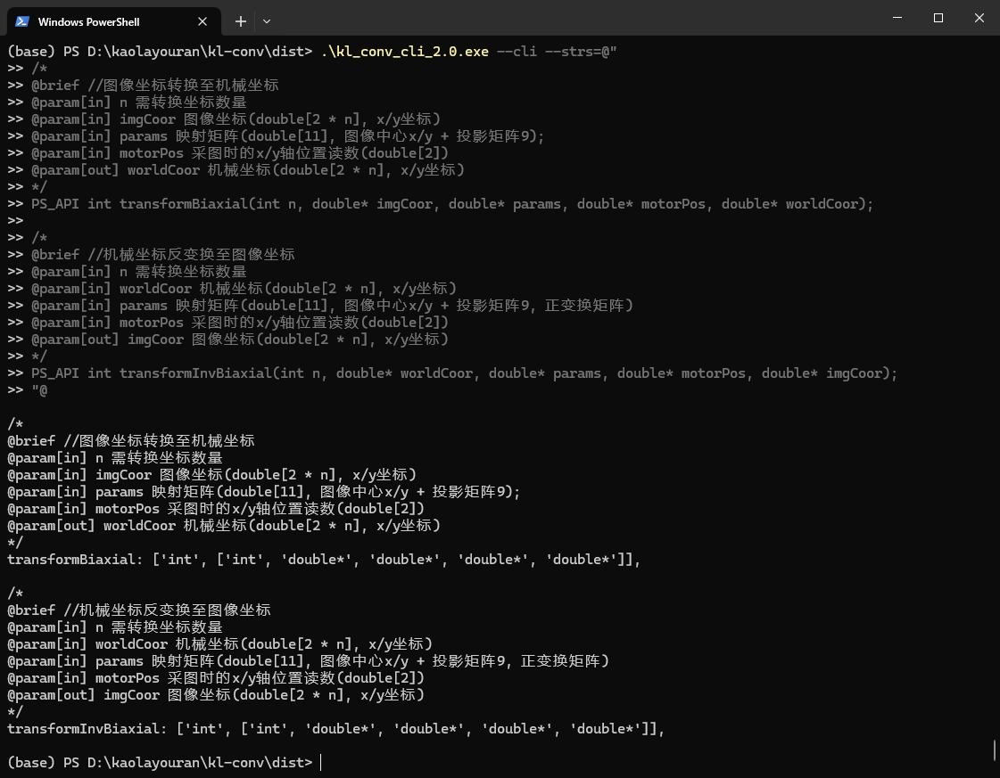

# Dll 链接库函数声明转换为 JS 函数声明

## 1. 打包

```bash
# 1. 创建虚拟环境
python -m venv venv
# 2. 激活虚拟环境
venv\Scripts\activate
# 3. 安装依赖
pip install -r requirements.txt
# 4. 执行打包指令，会输出GUI和命令行两个工具
python setup.py
```

## 2. 测试

```bash
pytest
```

## 3. 输入/输出示例

- 3.1 输入

```C++
PS_API int updateTransformParams(double* calib, double* rectify, double* update);

/*
@brief //图像坐标转换至机械坐标
@param[in] n 需转换坐标数量
@param[in] imgCoor 图像坐标(double[2 * n], x/y坐标)
@param[in] params 映射矩阵(double[11], 图像中心x/y + 投影矩阵9);
@param[in] motorPos 采图时的x/y轴位置读数(double[2])
@param[out] worldCoor 机械坐标(double[2 * n], x/y坐标)
*/
PS_API int transformBiaxial(int n, double* imgCoor, double* params, double* motorPos, double* worldCoor);

/*
@brief //机械坐标反变换至图像坐标
@param[in] n 需转换坐标数量
@param[in] worldCoor 机械坐标(double[2 * n], x/y坐标)
@param[in] params 映射矩阵(double[11], 图像中心x/y + 投影矩阵9, 正变换矩阵)
@param[in] motorPos 采图时的x/y轴位置读数(double[2])
@param[out] imgCoor 图像坐标(double[2 * n], x/y坐标)
*/
PS_API int transformInvBiaxial(int n, double* worldCoor, double* params, double* motorPos, double* imgCoor);


PS_API int transformInvBiaxialCenter(double* worldCoor, double* params, double* motorPos);

/*
@brief //机械坐标转换至行列坐标
@param[in] n 需转换坐标数量
@param[in] worldCoor 机械坐标(double[2 * n], x/y坐标)
@param[in] params 投影矩阵(double[9])
@param[out] mapCoor 行列坐标(double[2 * n], 列/行坐标)
*/
PS_API int transformMapping(int n, double* worldCoor, double* params, double* mapCoor);

/*
@brief //行列坐标反变换至机械坐标
@param[in] n 需转换坐标数量
@param[in] mapCoor 行列坐标(double[2 * n], 列/行坐标)
@param[in] params 投影矩阵(double[9], 正变换矩阵)
@param[out] worldCoor 机械坐标(double[2 * n], x/y坐标)
*/
PS_API int transformInvMapping(int n, double* mapCoor, double* params, double* worldCoor);

PS_API int getFullTransform(double* calibParams, double* rectifyParams, double* motorPos, double* mapParams, double* transParams = NULL, double* invParams = NULL);
```

- 3.2 输出

```javascript
updateTransformParams: ['int', ['double*', 'double*', 'double*']],

/*
@brief //图像坐标转换至机械坐标
@param[in] n 需转换坐标数量
@param[in] imgCoor 图像坐标(double[2 * n], x/y坐标)
@param[in] params 映射矩阵(double[11], 图像中心x/y + 投影矩阵9);
@param[in] motorPos 采图时的x/y轴位置读数(double[2])
@param[out] worldCoor 机械坐标(double[2 * n], x/y坐标)
*/
transformBiaxial: ['int', ['int', 'double*', 'double*', 'double*', 'double*']],

/*
@brief //机械坐标反变换至图像坐标
@param[in] n 需转换坐标数量
@param[in] worldCoor 机械坐标(double[2 * n], x/y坐标)
@param[in] params 映射矩阵(double[11], 图像中心x/y + 投影矩阵9, 正变换矩阵)
@param[in] motorPos 采图时的x/y轴位置读数(double[2])
@param[out] imgCoor 图像坐标(double[2 * n], x/y坐标)
*/
transformInvBiaxial: ['int', ['int', 'double*', 'double*', 'double*', 'double*']],


transformInvBiaxialCenter: ['int', ['double*', 'double*', 'double*']],

/*
@brief //机械坐标转换至行列坐标
@param[in] n 需转换坐标数量
@param[in] worldCoor 机械坐标(double[2 * n], x/y坐标)
@param[in] params 投影矩阵(double[9])
@param[out] mapCoor 行列坐标(double[2 * n], 列/行坐标)
*/
transformMapping: ['int', ['int', 'double*', 'double*', 'double*']],

/*
@brief //行列坐标反变换至机械坐标
@param[in] n 需转换坐标数量
@param[in] mapCoor 行列坐标(double[2 * n], 列/行坐标)
@param[in] params 投影矩阵(double[9], 正变换矩阵)
@param[out] worldCoor 机械坐标(double[2 * n], x/y坐标)
*/
transformInvMapping: ['int', ['int', 'double*', 'double*', 'double*']],

getFullTransform: ['int', ['double*', 'double*', 'double*', 'double*', 'double*', 'double*']],
```

## 4. 用法

- 4.1 命令行

```bash
# kl_conv_cli_xxx.exe
# --cli                 该选项是必需的
# -f="<input_path>"     该选项是必需的
# -o='<output_path>'    该选项可选，默认为当前目录
# -n='<output_name>'    该选项可选，默认为xxx
kl_conv_cli_xxx.exe --cli -f="./PS_DLL.h" -o="." -n="test"
```

## 5. 软件截图
- 5.1 GUI模式截图

- 5.2 CLI模式截图
